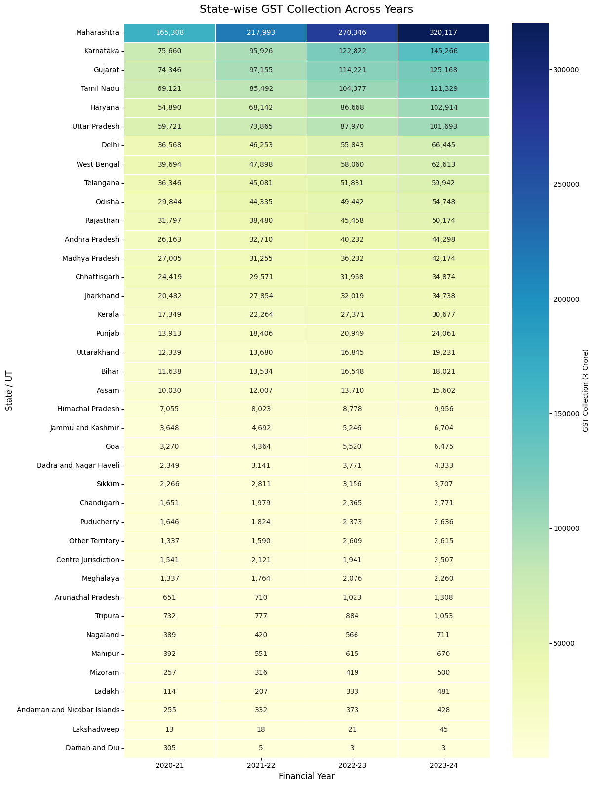
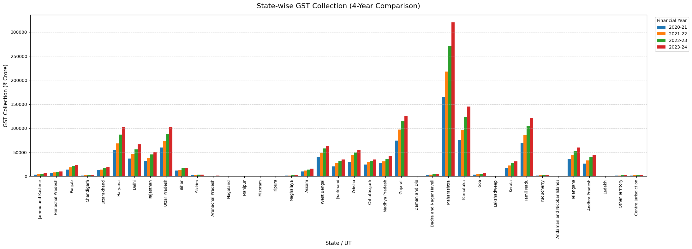
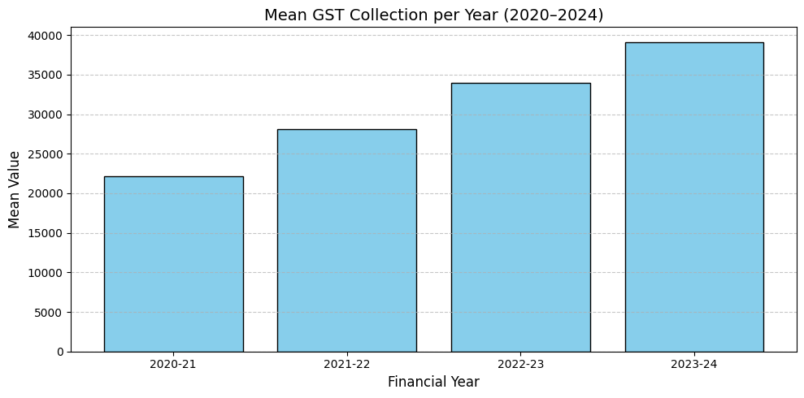
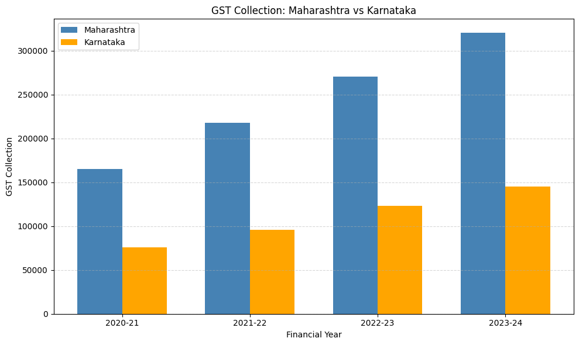
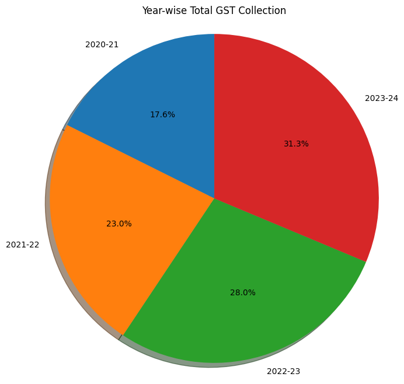
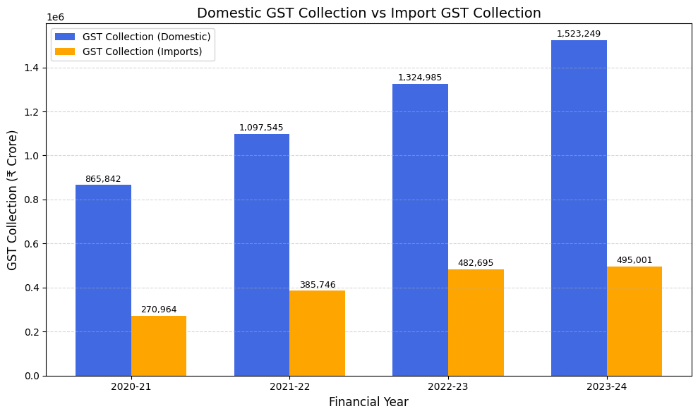

# GST State-wise Analysis and Clustering

An exploratory statistical analysis and machine learning study of **state-wise Goods and Services Tax (GST) collections in India** from FY 2020–21 to FY 2023–24.

The project uses descriptive statistics, data visualization, PCA, and K-Means clustering to examine patterns in GST collections, growth, and volatility across Indian States and Union Territories.

---
## Table of Contents

- [Overview](#overview)
- [Objectives](#objectives)
- [Dataset](#dataset)
- [Methodology](#methodology)
  - [1. Descriptive Statistical Analysis](#1-descriptive-statistical-analysis)
  - [2. Data Visualization](#2-data-visualization)
  - [3. Elbow Method vs. Silhouette Score](#3-elbow-method-vs-silhouette-score)
  - [4. GST State Clusters — K-Means](#4-gst-state-clusters--k-means)
    - [4.1 Normal GST State Clustering](#41-normal-gst-state-clustering)
      - [Purpose](#purpose)
      - [Results](#results)
      - [PCA Visualization](#pca-visualization)
    - [4.2 Growth-based GST State Clustering](#42-growth-based-gst-state-clustering)
      - [Purpose](#purpose-1)
      - [Results](#results-1)
      - [PCA Visualization](#pca-visualization-1)
    - [4.3 Volatility-based GST State Clustering](#43-volatility-based-gst-state-clustering)
      - [Purpose](#purpose-2)
      - [Results](#results-2)
      - [PCA Visualization](#pca-visualization-2)
- [Key Findings](#key-findings)
- [Technologies Used](#technologies-used)
- [Reproducing the Analysis](#reproducing-the-analysis)
- [Repository Structure](#repository-structure)
- [Data Source](#data-source)
- [Author](#author)
- [License](#license)

---
# Overview

Goods and Services Tax (GST) is India's unified indirect tax system. This project analyses GST collection patterns across Indian States and Union Territories using data from FY 2020–21 to FY 2023–24.

The analysis consists of four main stages:

1. **Descriptive statistical analysis**
2. **Data visualization**
3. **Cluster evaluation**
4. **K-Means clustering with PCA visualization**

Three different clustering perspectives are explored:

* Overall GST collection
* Year-over-Year (YoY) growth
* GST revenue volatility

The purpose is to identify patterns and similarities between jurisdictions rather than simply rank them by their GST collections.

---

# Objectives

The project aims to:

* Analyse the central tendency and distribution of state-wise GST collections.
* Measure variation using standard deviation.
* Examine skewness and kurtosis in GST collection data.
* Visualize state-wise GST collection patterns across financial years.
* Compare GST collection between major states.
* Identify an appropriate number of clusters using the Elbow Method and Silhouette Score.
* Group States/UTs using K-Means clustering.
* Analyse clusters based on:

  * Normal GST collection
  * YoY growth
  * Revenue volatility
* Use Principal Component Analysis (PCA) to visualize the resulting clusters in two dimensions.

---

# Dataset

The dataset contains GST collection data for Indian States and Union Territories across four financial years:

* FY 2020–21
* FY 2021–22
* FY 2022–23
* FY 2023–24

GST collection values are measured in **₹ crore**.

The dataset used in the analysis is located at:

```text
data/gst_data.csv
```

Additional information about the dataset is provided in:

```text
data/README.md
```

For state-level clustering, aggregate GST rows are excluded so that the clustering represents individual jurisdictions.

---

# Methodology

## 1. Descriptive Statistical Analysis

The first stage performs descriptive statistical analysis on the GST collection data.

The following measures are calculated:

### Mean

The arithmetic average of the GST collection values.

The year-wise mean GST collection was:

Statistic	2020–21	2021–22	2022–23	2023–24
Mean	74,748.8571	96,764.9524	117,627.2381	132,374.9286

The mean represents the average GST collection across all 42 observations in each financial year. The increase in the mean indicates that the average collection level rose over the study period.

### Median

The middle value when observations are arranged in ascending order.

Statistic	2020–21	2021–22	2022–23	2023–24
Median	11,988.5000	13,607.0000	16,696.5000	18,626.0000

The median represents the middle GST collection value when the observations are arranged from lowest to highest. The median is considerably lower than the mean in every year, indicating that the distribution is influenced by a smaller number of jurisdictions with very high collections.

### Standard Deviation

Measures the dispersion of GST collection values around the mean.

Statistic	2020–21	2021–22	2022–23	2023–24
Standard Deviation	217,538.3373	281,934.2063	342,989.6588	385,843.7030

The standard deviation measures how widely GST collections vary around the mean. Higher values indicate greater dispersion. The increasing standard deviation shows that the difference between jurisdictions became larger in absolute terms over the study period.

### Skewness

Measures the asymmetry of the distribution.

Statistic	2020–21	2021–22	2022–23	2023–24
Skewness	2.5155	2.6518	2.7291	2.8303

A positive skew indicates that a relatively small number of jurisdictions have substantially higher GST collections than the majority. Since skewness is positive in all four years and increases from 2.5155 to 2.8303, the distributions are strongly right-skewed.

### Kurtosis

Measures the concentration of observations in the tails of the distribution and the presence of extreme values.

Statistic	2020–21	2021–22	2022–23	2023–24
Kurtosis	7.7506	8.6339	9.0524	9.6920

The kurtosis values are high and increase over the study period, indicating increasingly pronounced tails and the presence of extreme observations in the GST collection distribution.

### Additional Descriptive Statistics

Statistic	2020–21	2021–22	2022–23	2023–24
Count	42	42	42	42
Minimum	13	5	3	3
25% (Q1)	1,388	1,779	2,148.25	2,534
50% (Median)	11,988.5	13,607	16,696.5	18,626
75% (Q3)	36,512.5	45,960	54,840	61,945.25
Maximum	1,136,805	1,483,291	1,807,680	2,018,249

The count shows the number of observations used in each year. Minimum and maximum show the lowest and highest GST collection values. The 25th percentile (Q1) means 25% of observations are at or below that value, while the 75th percentile (Q3) means 75% of observations are at or below that value. The difference between Q1 and Q3 represents the interquartile range and describes the spread of the middle 50% of observations.

The additional year-wise distribution statistics are:

Statistic	2020–21	2021–22	2022–23	2023–24
Variance	1,059,433,098.6815	1,783,772,579.0621	2,714,093,019.2605	3,729,578,846.6046
Standard Deviation	32,548.9339	42,234.7319	52,096.9579	61,070.2779

The variance is the squared measure of dispersion and is related to standard deviation by taking its square root. The standard deviation values here correspond to the state/UT-level observations used for the skewness and kurtosis calculations.

These statistics provide an initial understanding of the **central tendency, dispersion, asymmetry, and distributional characteristics** of state-wise GST collections.

---
## 2. Data Visualization

The project uses multiple visualizations to explore GST collection patterns before performing clustering.

---

### 2.1 GST Collection Across Years — Heatmap

The heatmap shows the GST collection values across States/UTs and financial years. It provides a quick visual comparison of collection levels and highlights differences between jurisdictions.



### 2.2 State-wise GST Collection — 4-Year Comparison

This visualization compares the GST collection of individual States/UTs across the four financial years, making differences in revenue levels and changes over time easier to observe.



### 2.3 Mean GST Collection per Year

The mean GST collection visualization shows the change in the average GST collection across the four financial years.



### 2.4 GST Collection: Maharashtra vs Karnataka

This comparison visualizes the GST collection trends of Maharashtra and Karnataka across the study period, allowing the collection patterns of two major GST-generating states to be compared directly.



### 2.5 Year-wise Total GST Collection

The year-wise visualization shows the overall GST collection across the financial years and illustrates the change in total collection over the study period.



### 2.6 Domestic GST Collection vs GST from Imports

This visualization compares domestic GST collection with GST collected from imports, providing an additional view of the composition of total GST collection.



---


# 3. Elbow Method vs. Silhouette Score

The appropriate number of clusters is evaluated using both the **Elbow Method** and **Silhouette Score**.

The selected clustering solution uses:

[
k=3
]

# 4. GST State Clusters — K-Means

K-Means clustering is performed using three different feature representations of the GST data.

Before clustering, the numerical features are standardized using `StandardScaler`.

PCA is then used to project the resulting clusters into two dimensions for visualization.

---

## 4.1 Normal GST State Clustering

The first K-Means analysis uses the four annual GST collection values:

* 2020–21
* 2021–22
* 2022–23
* 2023–24

These features represent the **overall revenue level** of each jurisdiction.

### Purpose

The objective is to group States/UTs with similar absolute GST collection patterns.

### Results

The clustering produces three broad groups:

Cluster 0 — Lower-revenue jurisdictions

* Jammu and Kashmir
* Himachal Pradesh
* Punjab
* Chandigarh
* Uttarakhand
* Bihar
* Sikkim
* Arunachal Pradesh
* Nagaland
* Manipur
* Mizoram
* Tripura
* Meghalaya
* Assam
* Daman and Diu
* Dadra and Nagar Haveli
* Goa
* Lakshadweep
* Kerala
* Puducherry
* Andaman and Nicobar Islands
* Ladakh
* Other Territory
* Centre Jurisdiction

This cluster represents jurisdictions with comparatively lower absolute GST collection levels across the four years.

Cluster 1 — High-revenue jurisdictions

* Gujarat
* Maharashtra
* Karnataka
* Tamil Nadu

Cluster 2 — Medium-revenue jurisdictions

* Jammu and Kashmir
* Himachal Pradesh
* Punjab
* Chandigarh
* Uttarakhand
* Delhi
* Rajasthan
* Uttar Pradesh
* Bihar
* Sikkim
* Manipur
* Tripura
* Meghalaya
* Assam
* West Bengal
* Jharkhand
* Odisha
* Chhattisgarh
* Madhya Pradesh
* Gujarat
* Daman and Diu
* Dadra and Nagar Haveli
* Maharashtra
* Kerala
* Tamil Nadu
* Andaman and Nicobar Islands
* Telangana
* Andhra Pradesh
* Centre Jurisdiction

This cluster contains the major GST-generating states with substantially higher absolute collection levels.

The remaining jurisdictions form the intermediate-revenue group between these two extremes. In the clustering output provided, this intermediate group is represented by the separation in the revenue feature space, while the explicitly listed clusters above identify the lower- and high-revenue groups.

Meaning of the clusters: Normal GST clustering groups jurisdictions according to their absolute revenue scale across 2020–21 to 2023–24. Therefore, membership primarily reflects the overall size of GST collections rather than the rate at which collections grew.

### PCA Visualization

The PCA 2D scatter plot provides a visual representation of these groups.

The revenue-level data is dominated by its first principal component, indicating that **overall fiscal scale is the major source of variation between jurisdictions**.

---

## 4.2 Growth-based GST State Clustering

The second K-Means analysis is based on **Year-over-Year (YoY) growth** rather than absolute GST collection.

YoY growth is calculated as:

[
YoY =
\frac{Current\ Year-Previous\ Year}
{Previous\ Year}
\times100
]

The resulting features represent the growth trajectory of each jurisdiction.

### Purpose

This clustering identifies jurisdictions with similar GST growth patterns.

Unlike normal clustering, a jurisdiction does not need to have a high absolute revenue level to belong to a high-growth cluster.

### Results

The growth-based analysis identifies:

Growth Cluster 0 — Higher-growth group

* Haryana
* Arunachal Pradesh
* Nagaland
* Mizoram
* Karnataka
* Goa
* Puducherry
* Ladakh
* Other Territory

These jurisdictions form the higher-growth cluster based on their YoY growth patterns.

Growth Cluster 1 — Extreme growth outlier

* Lakshadweep

Lakshadweep forms a separate cluster because its relatively small initial revenue base can produce very large percentage changes when GST collections change.

Growth Cluster 2 — Moderate-growth group

* Jammu and Kashmir
* Himachal Pradesh
* Punjab
* Chandigarh
* Uttarakhand
* Delhi
* Rajasthan
* Uttar Pradesh
* Bihar
* Sikkim
* Manipur
* Tripura
* Meghalaya
* Assam
* West Bengal
* Jharkhand
* Odisha
* Chhattisgarh
* Madhya Pradesh
* Gujarat
* Daman and Diu
* Dadra and Nagar Haveli
* Maharashtra
* Kerala
* Tamil Nadu
* Andaman and Nicobar Islands
* Telangana
* Andhra Pradesh
* Centre Jurisdiction

This cluster represents jurisdictions with more moderate and comparatively similar YoY growth trajectories.

Meaning of the clusters: Growth clustering groups jurisdictions according to their patterns of change in GST collections, rather than their absolute revenue levels. A smaller jurisdiction can therefore appear in a higher-growth cluster even when its total GST collection is much lower than that of a major state.

### PCA Visualization

A PCA 2D scatter plot is used to visualize the growth-based clusters.

The first two principal components explain approximately **85.9% of the variance**, providing a useful two-dimensional representation of the growth feature space.

---

## 4.3 Volatility-based GST State Clustering

The third K-Means analysis focuses on the **volatility of GST collections**.

Volatility is measured using the coefficient of variation:

[
CV =
\frac{Standard\ Deviation}
{Mean}
]

The coefficient of variation measures relative variability and allows jurisdictions with different revenue scales to be compared.

### Purpose

The objective is to identify jurisdictions with similar levels of GST revenue stability.

### Results

Volatility Cluster 0 — High relative volatility

* Lakshadweep
* Ladakh

These jurisdictions show comparatively high relative variability in GST collections.

Volatility Cluster 1 — Major volatility outlier

* Daman and Diu

Daman and Diu forms its own cluster because of its substantially different volatility pattern. This should be interpreted alongside administrative changes affecting the jurisdiction rather than automatically being treated as ordinary economic instability.

Volatility Cluster 2 — Relatively low-volatility group

* Jammu and Kashmir
* Himachal Pradesh
* Punjab
* Chandigarh
* Uttarakhand
* Haryana
* Delhi
* Rajasthan
* Uttar Pradesh
* Bihar
* Sikkim
* Arunachal Pradesh
* Nagaland
* Manipur
* Mizoram
* Tripura
* Meghalaya
* Assam
* West Bengal
* Jharkhand
* Odisha
* Chhattisgarh
* Madhya Pradesh
* Gujarat
* Dadra and Nagar Haveli
* Maharashtra
* Karnataka
* Goa
* Kerala
* Tamil Nadu
* Puducherry
* Andaman and Nicobar Islands
* Telangana
* Andhra Pradesh
* Other Territory
* Centre Jurisdiction

Most jurisdictions fall into this cluster, indicating comparatively similar and lower relative volatility.

Meaning of the clusters: Volatility clustering groups jurisdictions according to the relative variability of their GST collections, measured using the coefficient of variation. It therefore focuses on revenue stability rather than the absolute amount collected or the growth rate.

### PCA Visualization

The volatility-based clusters are visualized using a PCA 2D scatter plot.

The volatility clustering achieves the highest silhouette score:

**0.834**

indicating strong separation between the resulting clusters.

---
# Key Findings

1. **High-revenue cluster:** Gujarat, Maharashtra, Karnataka, and Tamil Nadu consistently form the high-revenue group, reflecting their strong industrial, services, corporate, urban, and consumption bases. Their high GST collections are therefore primarily associated with underlying economic structure rather than preferential tax treatment.

2. **Growth clusters:** The elevated-growth group is not economically homogeneous. It contains both smaller jurisdictions experiencing low-base effects/formalization and larger economies such as Haryana, Karnataka, and Goa experiencing more structural growth. Therefore, growth rates should be interpreted alongside absolute revenue levels.

3. **Lakshadweep as a growth outlier:** Lakshadweep forms an isolated cluster because its very small revenue base makes even modest absolute changes produce extremely large percentage growth rates. This is a statistical low-base effect rather than evidence of exceptional economic expansion.

4. **Volatility outliers:** Daman and Diu, Lakshadweep, and Ladakh show unusually high volatility. Daman and Diu's volatility is particularly associated with the administrative merger with Dadra and Nagar Haveli and changes in reporting boundaries.

5. **Overall revenue stability:** The majority of jurisdictions, including all four high-revenue states, exhibit relatively low and homogeneous volatility. This suggests that high volatility is concentrated in a small number of low-base or administratively affected jurisdictions rather than being a general feature of India's GST system.

6. **Policy implications:** GST revenue analysis should distinguish between jurisdictions based on revenue scale, growth characteristics, and volatility. Small or boundary-affected jurisdictions require different monitoring approaches from large, mature economies.

7. **Overall finding:** PCA and K-Means reveal that India's GST landscape is primarily shaped by **fiscal scale, differing growth trajectories, and concentrated volatility**, demonstrating that clustering provides a useful way to identify structurally similar jurisdictions beyond simple revenue rankings.

---
# Technologies Used

### Programming Language

* Python

### Data Analysis

* pandas
* NumPy
* SciPy

### Machine Learning

* scikit-learn

  * `StandardScaler`
  * `KMeans`
  * `PCA`
  * `silhouette_score`

### Data Visualization

* Matplotlib
* Seaborn
* Plotly

### Development Environment

* Google Colab
* Jupyter Notebook

---

# Reproducing the Analysis

## 1. Clone the repository

```bash
git clone https://github.com/karunarapolu/gst-clustering-analysis.git
cd gst-clustering-analysis
```

## 2. Install dependencies

Install the required Python packages using the included `requirements.txt`:

```bash
pip install -r requirements.txt
```

## 3. Open the notebook

Open:

```text
gst_analysis_and_clustering.ipynb
```

The notebook can be run using either **Google Colab** or **Jupyter Notebook**.

## 4. Dataset

The dataset is located at:

```text
data/gst_data.csv
```

Information about the dataset and its source is provided in:

```text
data/README.md
```

## 5. Run the analysis

Execute the notebook cells sequentially to reproduce:

1. Descriptive statistical analysis
2. State-wise GST visualizations
3. Elbow Method vs. Silhouette Score analysis
4. Normal K-Means clustering
5. Growth-based K-Means clustering
6. Volatility-based K-Means clustering
7. PCA 2D cluster visualizations

---

# Repository Structure

```text
gst-clustering-analysis/
│
├── LICENSE
├── README.md
├── requirements.txt
│
├── data/
│   ├── README.md
│   └── gst_data.csv
│
└── gst_analysis_and_clustering.ipynb
```

# Data Source

The GST dataset was obtained from the **Government of India's Open Government Data (OGD) Platform — data.gov.in**.

The dataset contains GST collection information for Indian States and Union Territories across the financial years covered by the analysis.

Further dataset information is available in [`data/README.md`](data/README.md).

---

# Authors

- **Rapole Disha**
- **Karuna Rapolu**

---

# License

This project is licensed under the **MIT License**.

See the [`LICENSE`](LICENSE) file for the complete license text.


